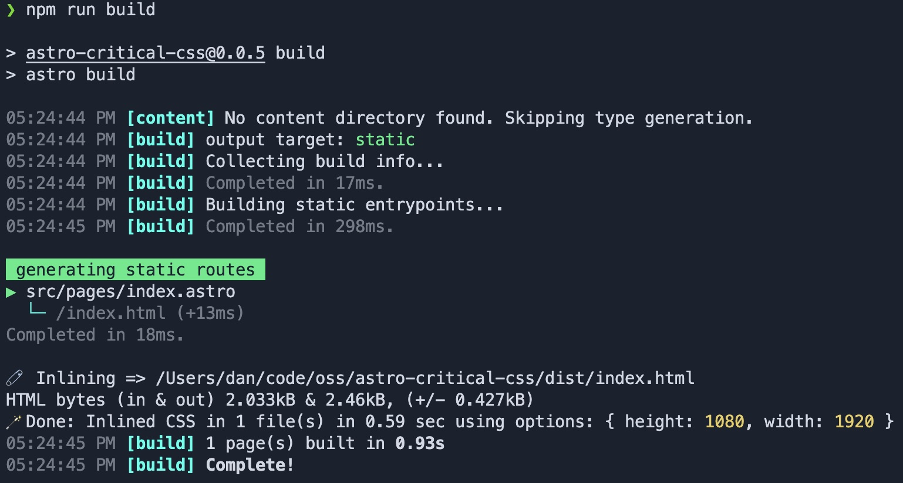
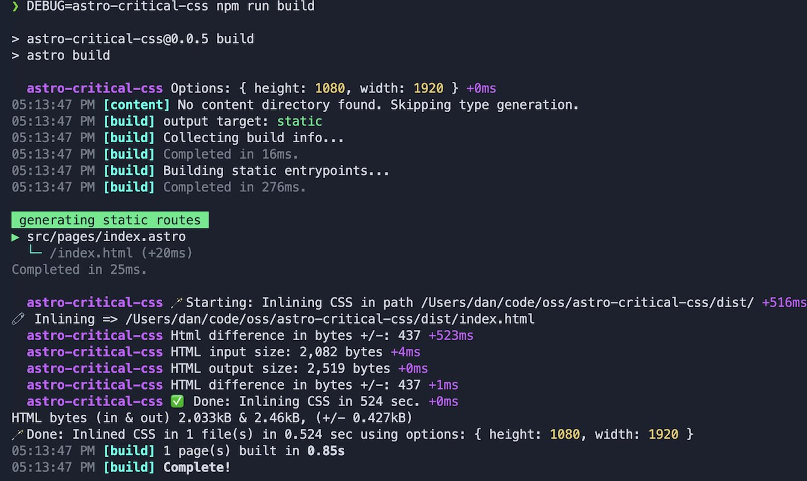

# Astro Critical CSS Integration

Astro Integration for [Critical](https://github.com/addyosmani/critical) package which inlines critical-path CSS into HTML and lazy loads remaining CSS which can greatly improve [First Contentful Paint (FCP)](https://web.dev/fcp/).

Read more about it here: [Extracting Critical CSS](https://web.dev/extract-critical-css/).

## Installation & Usage

### Astro Add

```sh
npx astro add astro-critical-css
# or
yarn astro add astro-critical-css
```

### Manually

```sh
# npm
npm install -D astro-critical-css
# yarn
yarn add -D astro-critical-css
```

In your `astro.config.mjs`:

```ts
import criticalCSS from "astro-critical-css";

export default defineConfig({
  integrations: [criticalCSS()],
});
```

During build this integration will look at all the static HTML files and run them through [Critical](https://github.com/addyosmani/critical). (Which depends on Puppeteer/Chromium.)

## Options

If you need options, `criticalCSS` supports the following config options:

```ts
// Options
criticalCSS({
  /** Silence log output (plugin specific, everything else is for criticalCSS) */
  silent: boolean,
  /** glob pattern to match html files, use this to selectively pick html files into which critical css will be inlined (ex: just the home page excluding nested pages).
   * By default, all html files in the dist directory will be inlined.
   */
  htmlPathRegex: string,
  /* HTML source to operate against */
  html: string,
  /* Array of CSS file paths, file globs, Vinyl objects, or source CSS strings */
  css: (string | unknown)[],
  /* Location of where to save the output of an operation. Use an object with 'html' and 'css' props if you want to store both. */
  target: string | { html: string, css: string, uncritical: string },
  /* Viewport width */
  width: number,
  /* Viewport height */
  height: number,
  /* Array of dimensions. Takes precedence over `width` and `height` if set. */
  dimensions: { width: number, height: number }[],
  /* Remove the inlined styles from any stylesheets referenced in the HTML.
    * It generates new references based on extracted content so it's safe to
    * use for multiple HTML files referencing the same stylesheet. Use with
    * caution. Removing the critical CSS per page results in a unique async
    * loaded CSS file for every page. Meaning you can't rely on cache across
    * multiple pages. */
  extract: boolean,
  /* Inline images */
  inlineImages: boolean,
  /* List of directories/urls for assets lookup */
  assetPaths: string[],
  /* Max file size for base64 inlined images */
  maxImageFileSize: number,
  /* Custom rebase options or function */
  rebase: RebaseOptions | ((url: string) => string),
  /* Ignore CSS rules (array or object) */
  ignore: (string | IgnoreOptions)[] | IgnoreOptions,
  /* Ignore inlined stylesheets */
  ignoreInlinedStyles: boolean,
  /* User agent to use when fetching remote src */
  userAgent: string,
  /* Penthouse configuration options */
  penthouse: object,
  /* Configuration options for got */
  request: object,
  /* Configuration options for CleanCSS */
  cleanCSS: object,
  /* Basic authorization: user */
  user: string,
  /* Basic authorization: pass */
  pass: string,
  /* Throw error on CSS parsing errors */
  strict: boolean,
});
```

## Logging

By default, `astro-critical-css` will log the output of the operation.



If you want to silence the logs, you can pass the `silent` option:

```ts
import criticalCSS from "astro-critical-css";

export default defineConfig({
  integrations: [criticalCSS({ silent: true })],
});
```

If you want verbose logging, set the `DEBUG` environment variable:

```sh
DEBUG=astro-critical-css npx astro build
# or
DEBUG=astro* npx astro build
```



## Astro SSR Mode

### Note for < Astro 2.0

⚠️ If your project uses [Astro SSR](https://docs.astro.build/en/guides/server-side-rendering/#enabling-ssr-in-your-project) mode, this integration will only inline HTML files that pre-rendered on build. You will need to enable [`experimental.prerender`](https://docs.astro.build/en/reference/configuration-reference/#experimentalprerender) in your astro config.

### Astro 2.0 and above

Check out [Hybrid Renderering](https://docs.astro.build/en/guides/server-side-rendering/#hybrid-rendering)

## Similar Libraries

- [astro-critters](https://github.com/astro-community/astro-critters)
